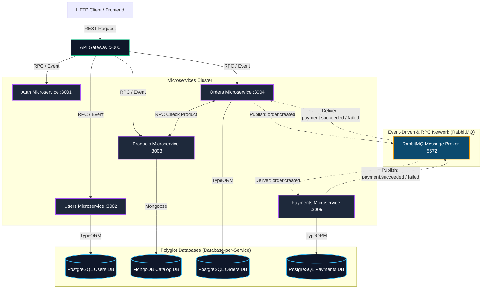
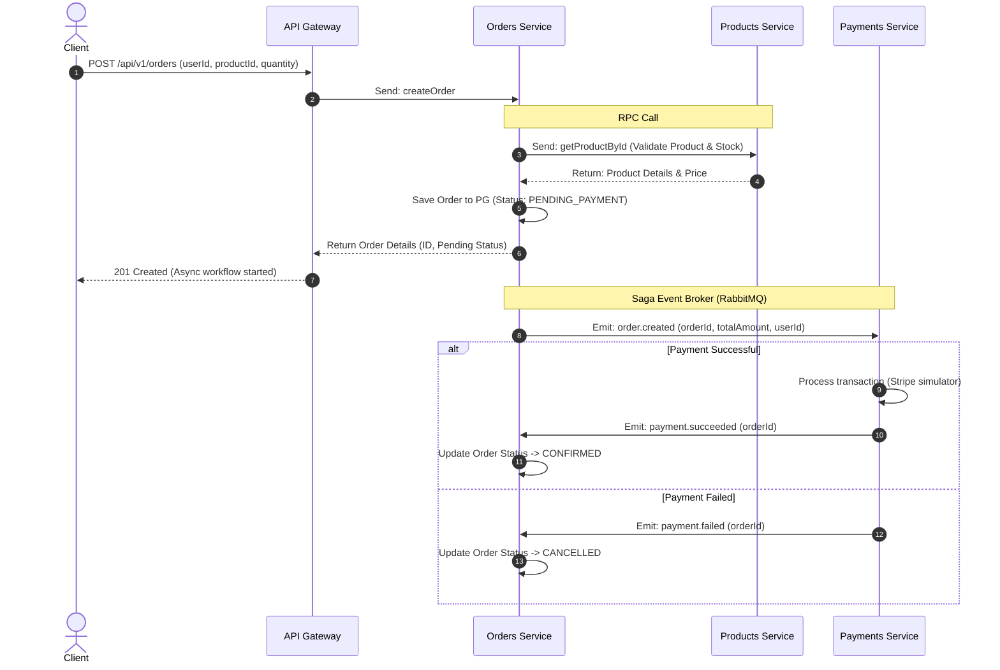

# 🚀 NestJS Polyglot Microservices E-Commerce

A state-of-the-art, fully distributed microservices e-commerce system built with **NestJS**, **Nx Monorepo**, and **Docker**. This project showcases modern backend engineering best practices, focusing on **Polyglot Persistence (Database-per-Service)**, **Asynchronous Event-Driven Saga Choreography**, and highly isolated service boundaries.

---

## 📐 System Architecture

Below is the distributed message-driven architecture showing how the API Gateway, individual microservices, RabbitMQ Event Bus, and databases (PostgreSQL & MongoDB) orchestrate to handle requests.



---

## 💾 Polyglot Persistence (Database-per-Service)

To enforce strict boundary isolation and alignment with Domain-Driven Design (DDD), this architecture implements **Polyglot Persistence**. Each microservice owns its data store, selecting the engine that best fits its domain model:

| Microservice | Data Model | Database | Technology | Rationale |
| :--- | :--- | :--- | :--- | :--- |
| **Users** | Relational | **PostgreSQL** | TypeORM | Enforces structural integrity, relations, and ACID transactions for user profiles. |
| **Products** | Document / Catalog | **MongoDB** | Mongoose | Flexible, schema-less document structure. Ideal for high-read speeds and polymorphic product attributes. |
| **Orders** | Transactional / Relational | **PostgreSQL** | TypeORM | Requires strict ACID transactions and precise tracking of order items and checkout states. |
| **Payments** | Relational / Audit Log | **PostgreSQL** | TypeORM | Crucial transactional consistency, financial history audit trails, and strict schema validation. |

---

## 🔄 Asynchronous Saga Event Choreography

The order checkout workflow is implemented using the **Saga Choreography Pattern** over **RabbitMQ** to maintain eventual consistency without blocking operations:



---

## 🛠️ Tech Stack & Design Patterns

*   **Framework**: NestJS (Modular Architecture, Hybrid Microservices)
*   **Monorepo Engine**: Nx (Fast caching, task execution, and dependency graphing)
*   **Messaging**: RabbitMQ (Message broker utilizing topic exchanges for choreography and RPC queues)
*   **Databases**:
    *   **PostgreSQL 15** (TypeORM)
    *   **MongoDB** (Mongoose with replica set configuration)
*   **Logger & Middleware**: Custom Winston logs with Fastify adapter, globally integrated validation, rate-limiting, and error-handling interceptors.
*   **Local Infrastructure**: Full containerization via Docker Compose.

---

## 🚀 Local Setup & Execution

### 1. Prerequisites
Ensure you have the following installed on your machine:
*   [Node.js (v20+)](https://nodejs.org/)
*   [Docker Desktop](https://www.docker.com/products/docker-desktop/)

### 2. Build the Monorepo
Compile the TypeScript services into build artifacts:
```bash
# Clean Nx cache and build all applications
npm run build
```

### 3. Spin Up the Stack with Docker Compose
Start the databases, message brokers, and NestJS microservices all at once:
```bash
docker compose up --build -d
```

To view logs for specific microservices or databases:
```bash
docker compose logs -f api-gateway order-service product-service
```

---

## 📡 API Demonstration & Endpoints

Use `curl` or Postman to test the saga choreography workflow and polyglot database persistence.

### 1. Create a Product (Stored in MongoDB)
Publish a new product to the catalog service:
```bash
curl -X POST http://localhost:3000/api/v1/products \
  -H "Content-Type: application/json" \
  -d '{
    "name": "Sony PlayStation 5",
    "description": "Next-gen gaming console with ultra-high speed SSD",
    "price": 499.99,
    "stock": 50
  }'
```
*Response Example:*
```json
{
  "_id": "60c72b2f9b1d8b2d4c8b4567",
  "name": "Sony PlayStation 5",
  "description": "Next-gen gaming console with ultra-high speed SSD",
  "price": 499.99,
  "stock": 50,
  "createdAt": "2026-06-24T12:00:00.000Z"
}
```

### 2. Create an Order (Stored in PostgreSQL, Orchestrates Saga)
Initiate a purchase using the MongoDB product ID. This triggers the Postgres storage, checks the MongoDB catalog via RPC, and publishes the event to RabbitMQ for processing:
```bash
curl -X POST http://localhost:3000/api/v1/orders \
  -H "Content-Type: application/json" \
  -d '{
    "userId": "usr-8827-xad",
    "productId": "60c72b2f9b1d8b2d4c8b4567",
    "quantity": 1
  }'
```
*Response Example (Immediate return while Payment runs async):*
```json
{
  "id": "ord-2938-zqw",
  "userId": "usr-8827-xad",
  "productId": "60c72b2f9b1d8b2d4c8b4567",
  "quantity": 1,
  "totalAmount": 499.99,
  "status": "PENDING_PAYMENT",
  "createdAt": "2026-06-24T12:01:10.000Z"
}
```

### 3. Check Order Status (Saga Completion Verification)
After a few seconds, fetch the order. The payment service will have processed the payment (simulated), emitted the succeeded/failed event, and the order status should be updated to `CONFIRMED`:
```bash
curl http://localhost:3000/api/v1/orders
```
*Response Example:*
```json
[
  {
    "id": "ord-2938-zqw",
    "userId": "usr-8827-xad",
    "productId": "60c72b2f9b1d8b2d4c8b4567",
    "quantity": 1,
    "totalAmount": 499.99,
    "status": "CONFIRMED",
    "createdAt": "2026-06-24T12:01:10.000Z"
  }
]
```

### 4. Direct Microservice Ports (Development Access)
While all API routing goes through the API Gateway on port `3000`, microservices are also running on direct ports for administrative and debug access:
*   **API Gateway**: `http://localhost:3000`
*   **RabbitMQ Dashboard**: `http://localhost:15672` (Credentials: `rabbitmq` / `rabbitmq`)
*   **Mongo Express**: `http://localhost:8081` (Credentials: `admin` / `password`)
*   **PostgreSQL**: Port `5432` (Credentials: `postgres` / `postgrespassword`)
*   **MinIO Console**: `http://localhost:9001` (Credentials: `minioadmin` / `minioadmin`)

---

## 🧼 Codebase Cleanliness & Best Practices
*   **Database Isolation**: No sharing of database tables or schemas. Cross-entity lookups occur via asynchronous event integration or RPC.
*   **DTO Validation**: Full request payloads are strictly validated using `class-validator` and mapped to typed objects before execution.
*   **Clean Architecture**: Separation of concerns inside microservices using controllers, services, repositories, and domain entities.
