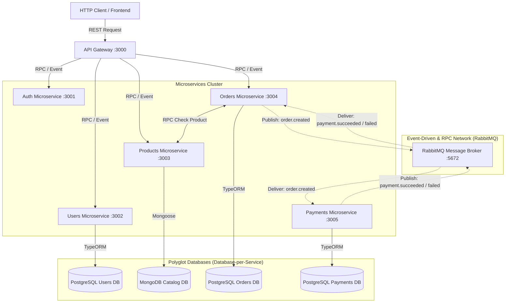
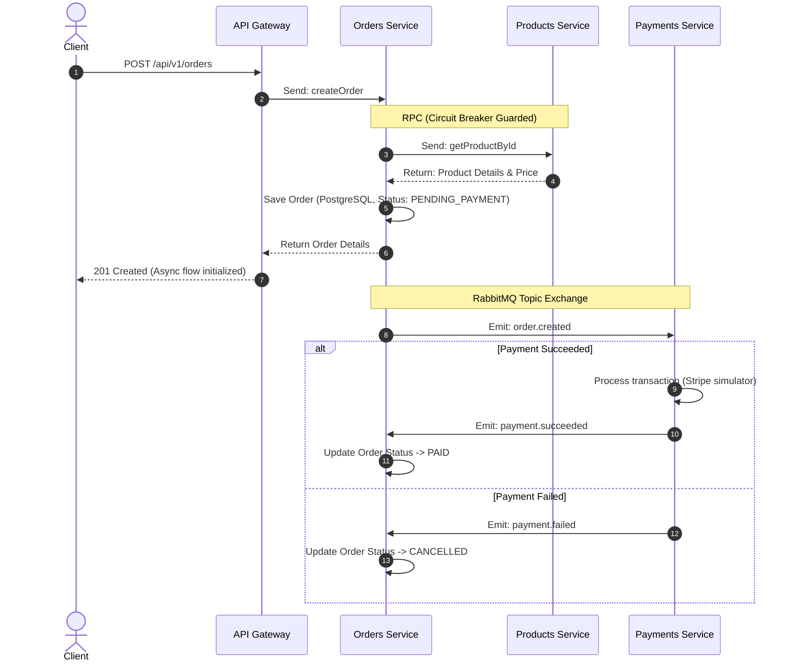

# 📐 NestJS Polyglot Microservices E-Commerce - System Architecture & Scaling to 1M+ DAU

This document defines the distributed architecture, database topologies, event choreography, and production scaling strategy for the NestJS microservices system.

---

## 🗺️ Architectural Topology

The system comprises an API Gateway acting as a single entry point, six specialized microservices executing business logic, a message-broker (RabbitMQ) handling RPC and Event choreography, and a polyglot database layout.

---

## 💾 Database-per-Service & Polyglot Persistence

To enforce complete decoupling, this architecture uses the **Database-per-Service** pattern. Cross-service data access happens solely via asynchronous events (RabbitMQ Pub/Sub) or synchronous RPCs.

### Rationale for Polyglot Storage
*   **Relational Model (PostgreSQL 15 + TypeORM)**: Emitted for `Users`, `Orders`, and `Payments`.
    *   **Orders & Payments**: Require strict ACID transactions to ensure financial logs, inventory allocations, and checkout states do not drift.
    *   **Users**: Enforces unique constraints, structured relations, and index efficiency on user profiles.
*   **Document Model (MongoDB + Mongoose)**: Emitted for `Products`.
    *   **Products Catalog**: Product structures are polymorphic (varying attributes by category). Storing them as JSON documents in MongoDB bypasses the cost of complex relational tables and joins, resulting in ultra-fast catalog reading.
*   **Search Index Model (Elasticsearch)**: Integrated with the `Products` Catalog service.
    *   **Fuzzy & Text Search**: Performing complex text search, typo tolerance, and keyword boosting directly in MongoDB causes high CPU load. By indexing products asynchronously in Elasticsearch on creation, we offload all search operations (`GET /api/v1/products/search?q=query`) to a dedicated inverted-index search engine, ensuring sub-10ms query latencies at scale.

---

## 🔄 Saga Choreography Flow

Because data is distributed, we cannot use database-level transactions across services. We use the **Saga Pattern (Event Choreography)** over RabbitMQ for eventual consistency:

## 🚀 Scaling to 1M+ Daily Active Users (DAU)

Scaling this system to support 1 Million Daily Active Users requires addressing critical bottlenecks across network gateways, DB connection limits, message brokers, distributed transactions, and logging.

### 1. Load Estimation (Back-of-the-Envelope Math)
*   **Active Users**: $1,000,000$ DAU.
*   **Throughput (QPS)**:
    *   Assuming an active user makes an average of $15$ requests per day (primarily browsing catalogs and viewing orders):
        $$\text{Total Requests/Day} = 1,000,000 \times 15 = 15,000,000 \text{ requests}$$
    *   Average QPS:
        $$\text{Average QPS} = \frac{15,000,000}{86,400} \approx 174 \text{ QPS}$$
    *   Peak QPS (assuming a $5\times$ peak factor during high-traffic campaign windows):
        $$\text{Peak QPS} = 174 \times 5 \approx 870 \text{ QPS}$$
    *   Write QPS (assuming a $3\%$ order checkout conversion rate):
        $$\text{Peak Order QPS} = 870 \times 0.03 \approx 26 \text{ write requests/sec}$$

---

### 2. High-Load Production Bottlenecks & Architectural Mitigations

#### 🛡️ API Gateway Network & Event-Loop Optimization
*   **The Problem**: At peak loads (1000+ RPS), the NestJS API Gateway (single-threaded Node.js event loop) will choke on CPU-intensive tasks like SSL/TLS termination, large JSON serialization/deserialization, and rate-limit evaluation.
*   **The Mitigation**:
    *   **Edge TLS Termination**: Offload SSL/TLS handshake overhead to a reverse proxy (Nginx/HAProxy) or cloud-native Load Balancer (AWS ALB). Do not let NestJS terminate TLS.
    *   **Horizontal Scaling & HPA**: Deploy the API Gateway inside a Kubernetes cluster, backed by a Horizontal Pod Autoscaler (HPA) configured to spin up new pods when average CPU usage exceeds $60\%$.
    *   **CDN Caching**: Route catalog images, product descriptions, and other static assets through a CDN (Cloudflare/AWS CloudFront) to intercept and cache $40\%$ of read traffic before it hits the gateway.

#### 💾 Database Connection Pool Exhaustion (PostgreSQL & MongoDB)
*   **The Problem**: If the microservices scale out horizontally to 20-30 replicas under load, each service instance opens its own connection pool. PostgreSQL spawns a dedicated operating system process per connection. Having hundreds of open connections leads to database memory exhaustion, high CPU context-switching overhead, and connection timeouts.
*   **The Mitigation**:
    *   **PgBouncer Connection Pooling**: Deploy PgBouncer in front of PostgreSQL, configured in `transaction` mode. Rather than binding a database session to a client for its entire lifetime, PgBouncer shares physical connections across active transactions, allowing thousands of NestJS instances to share a small pool of 100-150 physical Postgres connections.
    *   **Read-Write Splitting & Replica Lag**: Route write transactions (`INSERT`, `UPDATE`) to a primary PostgreSQL instance. Replicate asynchronously to multiple read-only replicas, distributing catalog/profile queries across them. To handle replication lag (where a user updates their profile and immediately loads the page, seeing old data), implement a "write-through" cache or route read requests for the same user to the primary database for a short window (e.g. 5 seconds) after any write.
    *   **MongoDB Replica Sets**: Configure Mongoose to connect to a MongoDB replica set using `readPreference=secondaryPreferred`. This ensures write-heavy catalog updates happen on the primary node, while browsing queries are distributed across secondary replica nodes.

#### ⚡ Distributed Caching (Cache-Aside Pattern with Redis)
*   **The Problem**: At 1M+ DAU, Products catalog reads will reach thousands of requests per second. Querying MongoDB for every individual product details load is extremely expensive and introduces high read latency.
*   **The Mitigation**:
    *   **Cache-Aside with Redis**: We wrap `getProductById` in the Products catalog service with a Redis Cache-Aside layer. When a detail request is received, the service checks Redis first. On a cache hit, the JSON response is returned in <2ms. On a cache miss, the data is fetched from MongoDB and cached in Redis with a 10-minute TTL (600s), shielding MongoDB from 90% of redundant reads. Connection failures to Redis are caught gracefully, allowing immediate failover directly to MongoDB without service disruption.

#### 🔄 Saga Consistency Anomalies, Row Locks & Event Race Conditions
*   **The Problem**: Saga choreography runs asynchronously without global database locks. Highly concurrent events can result in race conditions:
    *   **Out-of-Order Execution**: A user requests a cancellation immediately after checkout. The `order.cancelled` event and `payment.succeeded` event are processed concurrently. If `payment.succeeded` executes last, it could overwrite the `CANCELLED` status with `PAID`, charging the user but leaving the order in an invalid state.
    *   **Row Locking Contention**: Multiple updates to the same order row can lead to transaction deadlocks in PostgreSQL.
*   **The Mitigation**:
    *   **Strict State Machine Validation**: Implement unidirectional state transitions in the Orders database. A terminal status (like `CANCELLED`) must never be modified by incoming events. If `payment.succeeded` arrives for a `CANCELLED` order, the Orders service must reject the status transition and automatically publish a compensating event (`payment.refund_requested`).
    *   **Optimistic Locking**: Maintain a `version` column on transactional entities (Users, Orders). Use TypeORM's `@VersionColumn`. When updating a record, check that the version matches the read state; if it fails, throw a concurrency conflict exception and safely retry the event consumption.
    *   **Transactional Outbox Pattern**: Avoid dual-write vulnerabilities where a database transaction succeeds but the corresponding message broker publish fails (or vice versa). Save both the entity state and the outbound message event within the same PostgreSQL transaction using a local `outbox` table. A background worker (using Change Data Capture like Debezium, or polling the outbox table via Redis/Cron) guarantees at-least-once message delivery to RabbitMQ.

#### ⚡ RabbitMQ Broker Congestion & Flow Control
*   **The Problem**: Under extreme load, if consumers (e.g. Orders or Payments) experience database performance degradation, messages stack up. RabbitMQ's memory usage spikes. When it hits the high watermark, RabbitMQ triggers Flow Control, blocking all incoming publishing connections. This blocks the API Gateway from taking orders.
*   **The Mitigation**:
    *   **Quorum Queues**: Deploy Quorum Queues (Raft-based consensus queues) instead of classic queues for transactional pipelines. They guarantee message durability and clustering safety under node crashes.
    *   **Dead Letter Exchanges (DLX) & Retry Queues**: Configure RabbitMQ with a DLX. When message processing fails (e.g., database timeout), route the message to a delayed-retry queue with exponential backoff (e.g., 5s, 10s, 30s) instead of keeping it at the head of the main queue and blocking other messages.
    *   **Consumer Prefetch Optimization**: Set a strict `prefetch` count (e.g., 50) on consumers. This prevents RabbitMQ from dumping thousands of unacknowledged messages onto a single NestJS worker node, distributing them evenly among competing consumer instances.

#### 🌐 Decoupling Network Joins (Denormalization)
*   **The Problem**: In a shared monolithic database, showing a customer's order history page with product names and images is a simple `JOIN` query. In a decoupled polyglot architecture, Orders is in Postgres and Products is in MongoDB. Doing N+1 RPC calls to the Products service to render the order listing page will saturate the network and crash the Products service.
*   **The Mitigation**:
    *   **Schema Denormalization**: Store a snapshot of the essential product catalog details (such as `productName`, `unitPrice`, and `thumbnailUrl`) directly inside the PostgreSQL `OrderItems` schema at the time of purchase. This guarantees that the order history page can be rendered instantly with a single PostgreSQL query, without requiring network calls to the Products service. The catalog information remains correct even if the product's price or description changes in MongoDB in the future.

#### 👁️ Distributed Observability & Context Propagation
*   **The Problem**: Tracing a single client transaction that spans API Gateway -> Orders Service -> Products Service (RPC) -> RabbitMQ -> Payments Service is impossible using separate console logs.
*   **The Mitigation**:
    *   **OpenTelemetry (OTel)**: Instrument all NestJS microservices with OpenTelemetry auto-instrumentation.
    *   **W3C Context Propagation**: Ensure the API Gateway generates a unique `traceparent` (trace ID). Propagate this ID across HTTP headers, RPC metadata, and RabbitMQ message headers. Inject the trace ID into custom Winston log formats, allowing developers to query a single trace ID across Jaeger, Zipkin, or Datadog to visualize the entire distributed call stack.
