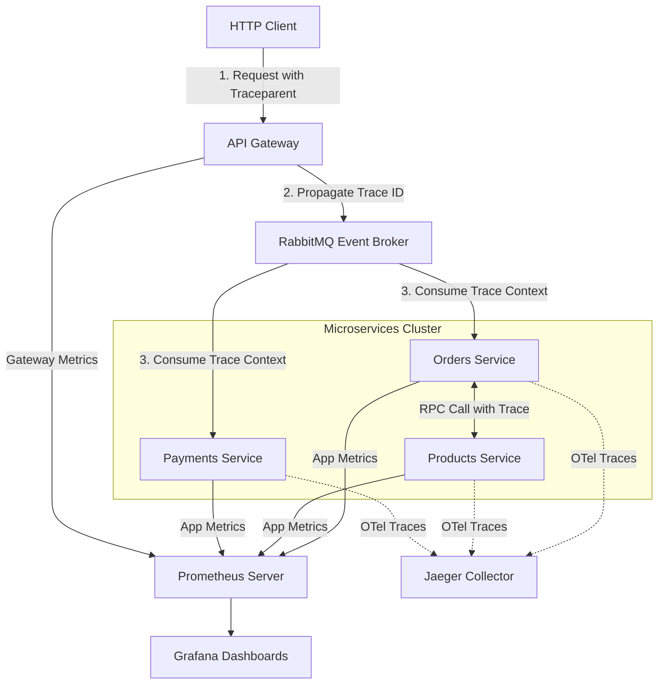

# 👁️ Distributed Logging, Monitoring & Observability at Scale (1M+ DAU)

Ensuring high availability and low latency in a distributed microservices e-commerce system requires a unified observability stack. This document details the monitoring, distributed tracing, and centralized logging architecture for our services.

---

## 🗺️ Observability Architecture Overview



---

## 1. Distributed Tracing (W3C Context Propagation)

Tracing requests across network boundaries is implemented using **W3C Trace Context Propagation** (`traceparent` header).

### W3C Traceparent Header Format
Every request is tagged with a trace identifier formatted as:
`00-[trace_id]-[span_id]-[flags]`
*   **`version` (00)**: Current W3C standard version.
*   **`trace_id`** (32 hex characters): Globally unique identifier for the entire request lifecycle.
*   **`span_id`** (16 hex characters): Unique identifier for the current segment of the request (e.g., API Gateway to Orders).
*   **`flags` (01)**: Recording flags (01 indicates trace recording is enabled).

### Codebase Propagation Flow:
1.  **API Gateway**: `TraceMiddleware` interceptor checks for an incoming `traceparent` header. If missing, it generates a new traceparent and sets it on the Fastify request context.
2.  **RPC & Events**: Outbound RabbitMQ messages and RPC commands include the `traceparent` and `x-correlation-id` in the message header metadata.
3.  **Microservices**: Downstream microservices parse the trace header, using it to correlate database queries, Winston console logs, and errors back to the client's initial HTTP request.

---

## 2. Centralized Logging (Winston & S3)

To prevent parsing logs across scattered Docker containers or Kubernetes pods, we route all application logs to a centralized storage:

### Log Structure
All logs are structured as JSON (production mode) to allow indexing and querying by Elasticsearch or Logstash:
```json
{
  "timestamp": "2026-06-25T20:00:00.000Z",
  "level": "error",
  "message": "Payment failed due to insufficient amount value.",
  "metadata": {
    "traceId": "4bf92f3577b34da6a3ce929d0e0e4736",
    "userId": "usr-8827-xad",
    "orderId": "ord-2938-zqw"
  }
}
```

### Log Archiving (Winston S3 Transport)
*   Logs are buffered in memory and uploaded to **MinIO / AWS S3** in batches grouped by `userId` and `service-name`.
*   Retention policies archive old logs to cold storage (Glacier) after 30 days to optimize storage costs.

---

## 3. Metrics Collection (Prometheus & Grafana)

We scrape application and infrastructure metrics every 15 seconds to visualize performance on Grafana dashboards.

### Key Metrics to Monitor:

#### ⚡ Application Metrics (NestJS Services)
*   `nodejs_eventloop_lag_seconds`: Event-loop delay. Alerts fire if lag > 100ms (indicates blocking CPU tasks).
*   `http_request_duration_seconds`: Response latency percentiles (p50, p90, p99) per endpoint.
*   `http_requests_total`: Throughput (QPS) classified by HTTP status code. Look for spikes in `5xx` responses.

#### 💾 Database Metrics (PostgreSQL & PgBouncer)
*   `pgbouncer_pools_client_connections_waiting`: Number of clients waiting for a physical DB connection. A value > 0 means PgBouncer's connection pool size must be scaled up.
*   `pg_stat_database_numbackends`: Total active physical connections to PostgreSQL.
*   `pg_stat_database_xact_commit` / `pg_stat_database_xact_rollback`: Database transaction health.

#### 🔄 Message Broker Metrics (RabbitMQ)
*   `rabbitmq_queue_messages`: Number of messages ready or unacknowledged. Spikes indicate consumer backlog or network disconnects.
*   `rabbitmq_queue_consumers`: Active consumer count. Alerts trigger if consumer count drops to 0 (indicates consumer service crashed).
*   `rabbitmq_process_open_fds`: File descriptor usage on RabbitMQ broker node.

#### 📁 Cache Metrics (Redis)
*   `redis_connected_clients`: Active client connections.
*   `redis_used_memory`: Memory footprint. Configure `maxmemory` eviction policy (`allkeys-lru`) to avoid Redis Out-Of-Memory (OOM) failures.

---

## 4. Setting Up Prometheus Scraping Config

Add the following jobs to your `prometheus.yml` file to scrape metrics from the container network:

```yaml
global:
  scrape_interval: 15s

scrape_configs:
  - job_name: 'api-gateway'
    static_configs:
      - targets: ['api-gateway:3000']
        labels:
          group: 'gateway'

  - job_name: 'orders-service'
    static_configs:
      - targets: ['order-service:3004']
        labels:
          group: 'services'

  - job_name: 'rabbitmq'
    static_configs:
      - targets: ['rabbitmq:15692'] # RabbitMQ prometheus plugin port

  - job_name: 'pgbouncer'
    static_configs:
      - targets: ['pgbouncer_exporter:9127']
```
